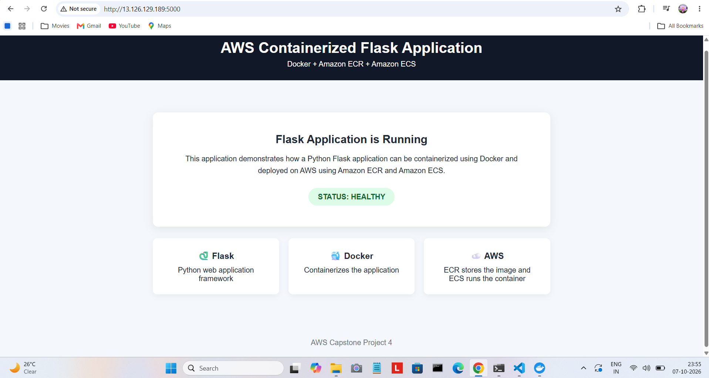
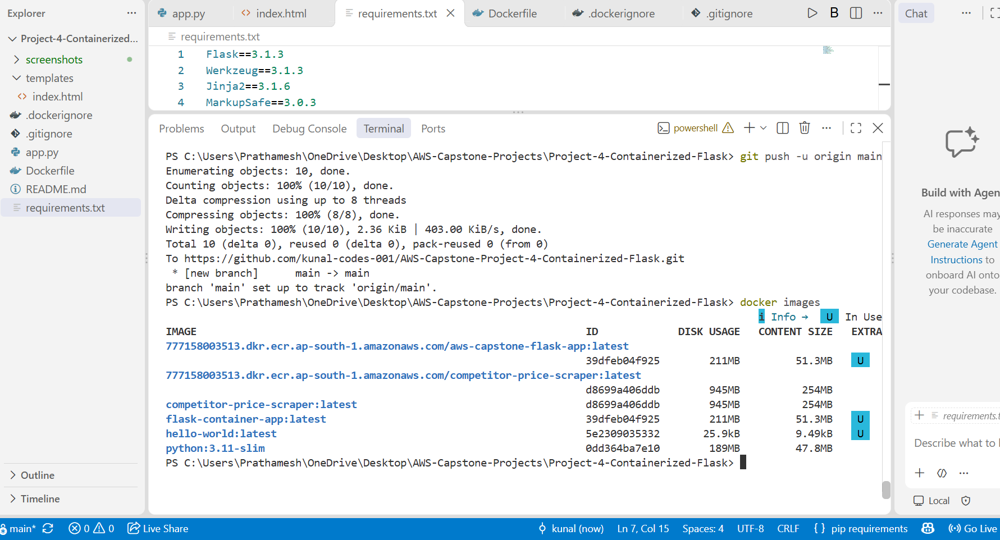
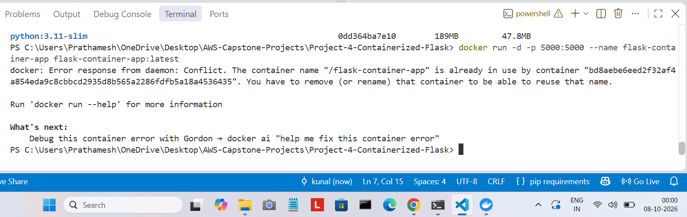
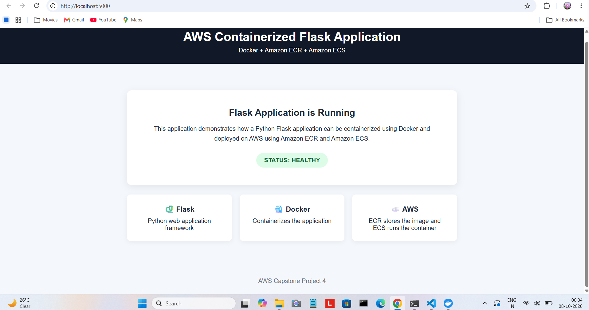
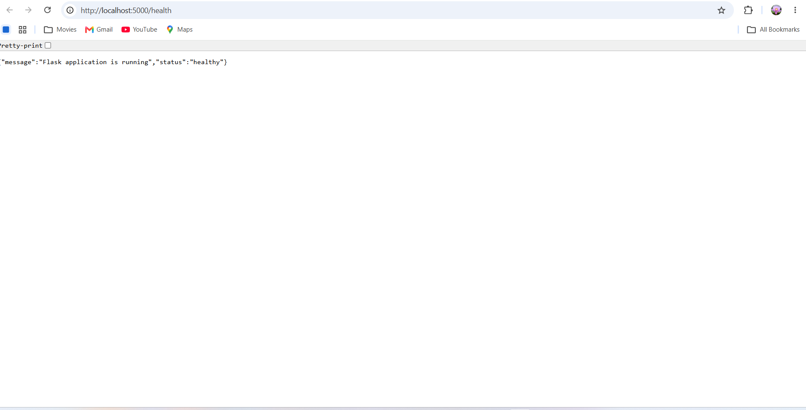
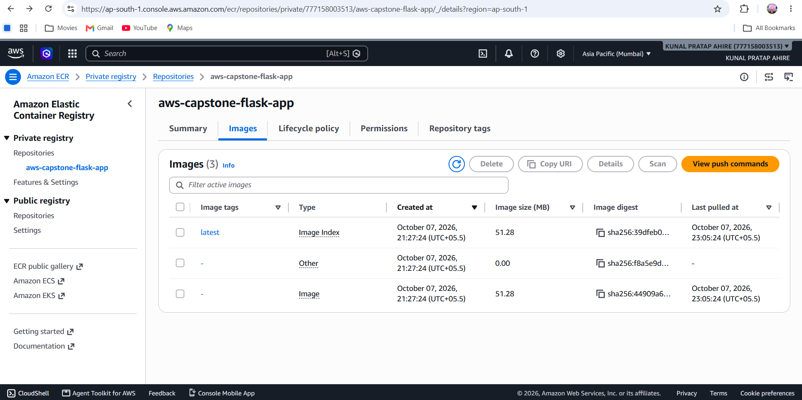
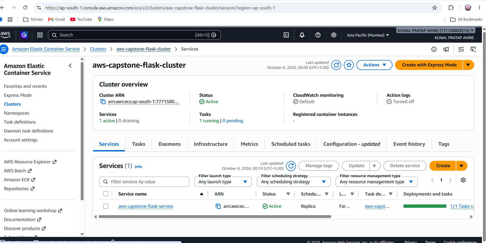
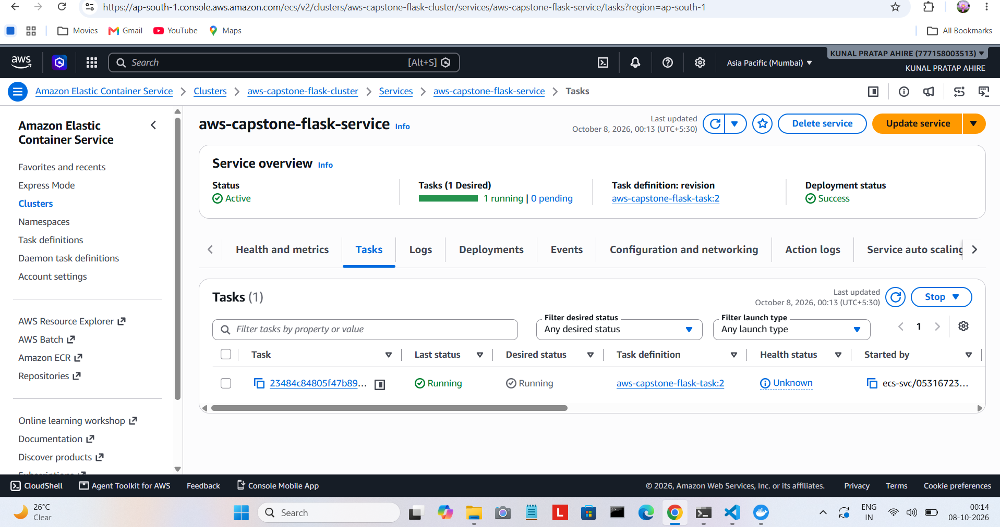
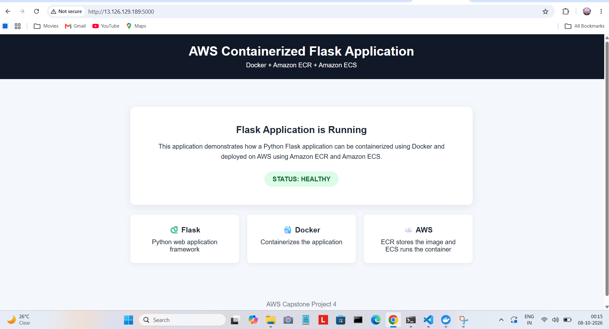
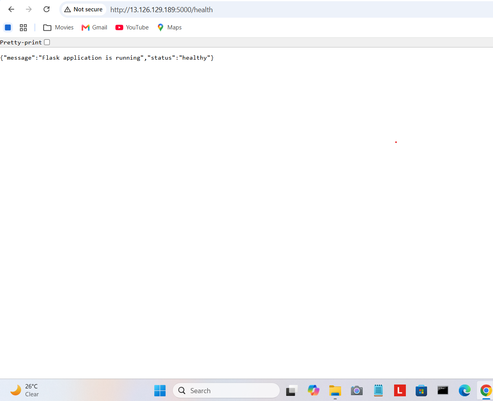

# AWS Capstone Project 4 — Containerized Flask Application

## 1. Project Title

Containerized Flask Application using Docker, Amazon ECR and Amazon ECS

## 2. Objective

In this project, I created a simple Python Flask web application and containerized it using Docker. I then pushed the Docker image to Amazon ECR and deployed the application on Amazon ECS using AWS Fargate.

## 3. Technologies and AWS Services

### Technologies

* Python
* Flask
* Docker
* HTML
* Git
* GitHub

### AWS Services

* Amazon ECR
* Amazon ECS
* AWS Fargate
* IAM
* Amazon VPC
* Amazon CloudWatch

## 4. Architecture

```text
Python Flask Application
          |
          v
        Docker
          |
          v
     Docker Image
          |
          v
     Amazon ECR
          |
          v
   Amazon ECS / Fargate
          |
          v
       Public IP
          |
          v
        Browser
```

## 5. Project Structure

```text
Project-4-Containerized-Flask/
│
├── app.py
├── requirements.txt
├── Dockerfile
├── .dockerignore
├── .gitignore
├── README.md
│
├── templates/
│   └── index.html
│
└── screenshots/
    ├── 01-local-flask-app.png
    ├── 02-docker-image.png
    ├── 03-docker-container-running.png
    ├── 04-docker-app.png
    ├── 05-docker-health.png
    ├── 06-ecr-image.png
    ├── 07-ecs-cluster.png
    ├── 08-ecs-service-running.png
    ├── 09-aws-flask-app.png
    └── 10-aws-health-check.png
```

## 6. Flask Application

I created a simple Flask application with two endpoints.

### Home Page

```text
GET /
```

This page displays the Flask application in the browser.

### Health Check

```text
GET /health
```

The health check returns:

```json
{
    "message": "Flask application is running",
    "status": "healthy"
}
```

## 7. Docker Configuration

I used Docker to package the Flask application and its required dependencies into a container.

The basic process was:

```text
Flask Application
       |
       v
requirements.txt
       |
       v
Dockerfile
       |
       v
Docker Image
```

The application runs on port `5000`.

### Build Docker Image

```bash
docker build -t flask-container-app .
```

### Run Docker Container

```bash
docker run -d -p 5000:5000 --name flask-container-app flask-container-app:latest
```

### Check Running Container

```bash
docker ps
```

### Test Local Application

Open:

```text
http://localhost:5000/
```

Health check:

```text
http://localhost:5000/health
```

## 8. Amazon ECR

After creating the Docker image, I pushed it to Amazon Elastic Container Registry (ECR).

### ECR Repository

```text
aws-capstone-flask-app
```

### Repository URI

```text
777158003513.dkr.ecr.ap-south-1.amazonaws.com/aws-capstone-flask-app
```

### Login to ECR

```bash
aws ecr get-login-password --region ap-south-1 | docker login --username AWS --password-stdin 777158003513.dkr.ecr.ap-south-1.amazonaws.com
```

### Tag Docker Image

```bash
docker tag flask-container-app:latest 777158003513.dkr.ecr.ap-south-1.amazonaws.com/aws-capstone-flask-app:latest
```

### Push Image to ECR

```bash
docker push 777158003513.dkr.ecr.ap-south-1.amazonaws.com/aws-capstone-flask-app:latest
```

## 9. Amazon ECS Deployment

I used Amazon ECS with AWS Fargate to run the Docker container.

### ECS Cluster

```text
aws-capstone-flask-cluster
```

### ECS Service

```text
aws-capstone-flask-service
```

### Task Definition

```text
aws-capstone-flask-task:2
```

### Launch Type

```text
AWS Fargate
```

### Container Port

```text
5000
```

The ECS task was configured with a public IP so that I could access the Flask application from a browser.

## 10. Deployment Testing

After deploying the application on ECS, I tested it using the public IP.

### Application

```text
http://13.126.129.189:5000/
```

### Health Check

```text
http://13.126.129.189:5000/health
```

The health check returned:

```json
{
    "message": "Flask application is running",
    "status": "healthy"
}
```

This confirmed that the Flask application was running successfully inside the ECS Fargate container.

## 11. Screenshots

### 1. Local Flask Application



### 2. Docker Image



### 3. Docker Container Running



### 4. Docker Application



### 5. Docker Health Check



### 6. Amazon ECR Image



### 7. Amazon ECS Cluster



### 8. ECS Service and Running Task



### 9. AWS Deployed Flask Application



### 10. AWS Health Check



## 12. Key Learnings

* Learned how to create a Flask application using Python.
* Learned how to create a Dockerfile and build a Docker image.
* Learned how to run and test a Docker container locally.
* Learned how to create an ECR repository.
* Learned how to push a Docker image to ECR.
* Learned how to create an ECS cluster and task definition.
* Learned how to deploy a Docker container using AWS Fargate.
* Learned how to configure container port mapping.
* Learned how to test an application running on AWS.
* Learned basic IAM, VPC and security group configuration.

## 13. Conclusion

In this project, I created a Flask application, packaged it using Docker, and pushed the Docker image to Amazon ECR. I then deployed the container on Amazon ECS using AWS Fargate.

The application was successfully accessed through a public IP, and the health check confirmed that the application was running correctly.
